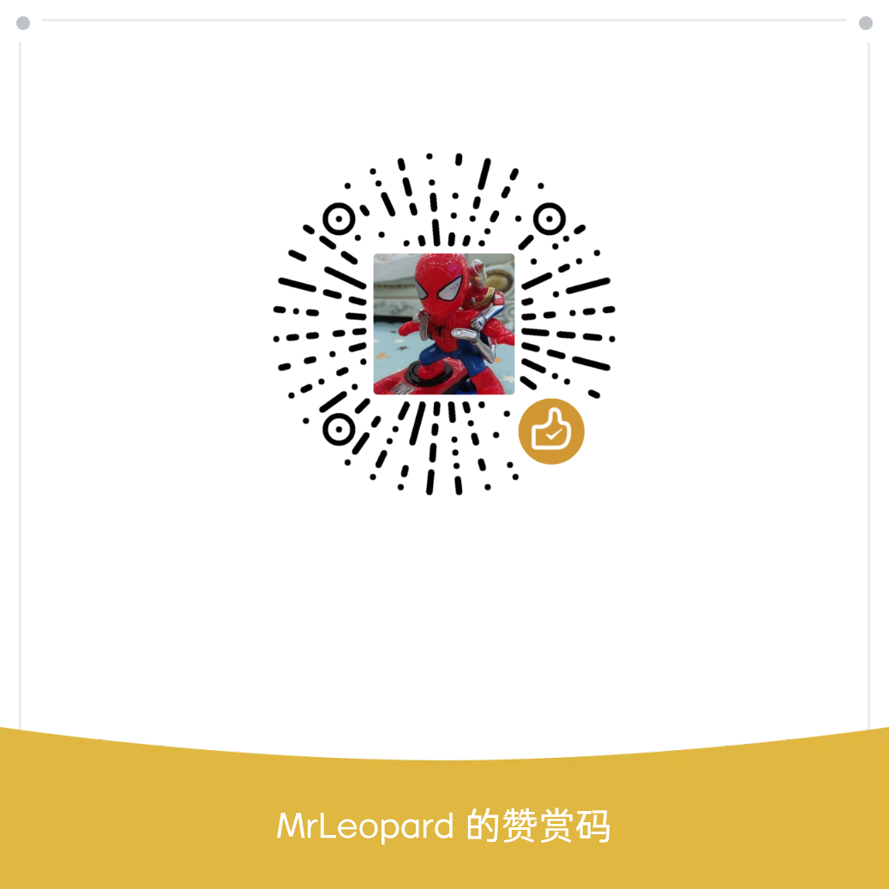

# 1.依赖  
## windows  

```
python3 -m pip install requests bs4
```


## linux & mac  

```
python3 -m pip install requests bs4  
```

*如linux无pip，需先安装pip*

```
sudo pip install python3-pip
```

*工程自带编译脚本，可以执行编译:*
```
pyinstallder compile.spec
```


# 2.运行  

```
python3 driver_ui.py
```


# 3.快捷键（快捷键的字母不分大小写）    
>## 全局  
	- 缩小字体  
	=  加大字体  
	/  切换黑白主题    
	数字0  全屏\退出全屏  

>## 新闻列表  
	left 上一页  
	right 下一页  
	字母[a-o]  打开对应的新闻  

>## 新闻正文
	UP  滚动条上
	Down 滚动条下
	B 启动浏览器查阅此新闻
	Backspace 返回新闻列表
	pageup 上一篇新闻
	pageDown 下一篇新闻


# TODO：

#### 后面要不要加个自定义主题和字体功能？

欢迎打赏：    
